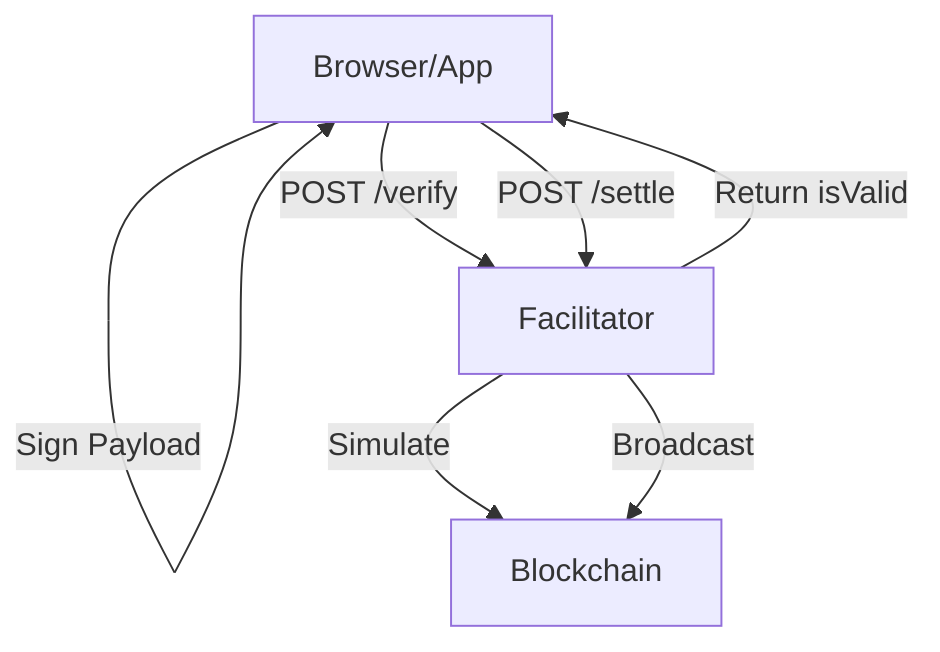

# x402 Facilitator: Integration Guideline

This document provides technical instructions for integrating with the x402 Facilitator for MultiversX.

## 1. System Architecture

The Facilitator acts as a stateless verification and stateful settlement service.



## 2. Integration for Client Apps

### Signing a Payload

To sign a payload that the facilitator will accept, follow the deterministic serialization format:

```typescript
const parts = [
    payload.nonce.toString(),
    payload.value,
    payload.receiver,
    payload.sender,
    payload.gasPrice.toString(),
    payload.gasLimit.toString(),
    payload.data || "",
    payload.chainID,
    payload.version.toString(),
    payload.options.toString()
];
const message = parts.join('|');
const signature = await signer.sign(Buffer.from(message));
```

### Requesting Verification

Before settling, it is recommended to call `/verify` to ensure the intent matches your requirements and is valid on-chain.

```json
{
  "scheme": "exact",
  "payload": {
    "nonce": 42,
    "value": "1000000000000000000",
    "receiver": "erd1...",
    "sender": "erd1...",
    "gasLimit": 50000,
    "chainID": "D",
    "version": 1,
    "options": 0,
    "signature": "..."
  },
  "requirements": {
    "payTo": "erd1...",
    "amount": "1000000000000000000",
    "asset": "EGLD",
    "network": "multiversx:D"
  }
}
```

## 3. Operations & Security

### Idempotency
The facilitator assigns a unique ID to every payment based on the SHA-256 hash of the signature. This ensures that the same payment is never settled twice, even if the user or relayer retries multiple times.

### Relayed V3
If your server has the relayer PEM configured, it will automatically sign the transaction as a relayer. This allows users to pay for transactions without having EGLD for gas.

### Cleanup
The internal storage is periodically cleaned up. Ensure your `validBefore` timestamps are reasonable (e.g., 5-30 minutes) to allow sufficient time for settlement.

---
> [!IMPORTANT]
> Always verify the `network` and `asset` fields in the requirements to prevent cross-chain or cross-token replay attacks.
